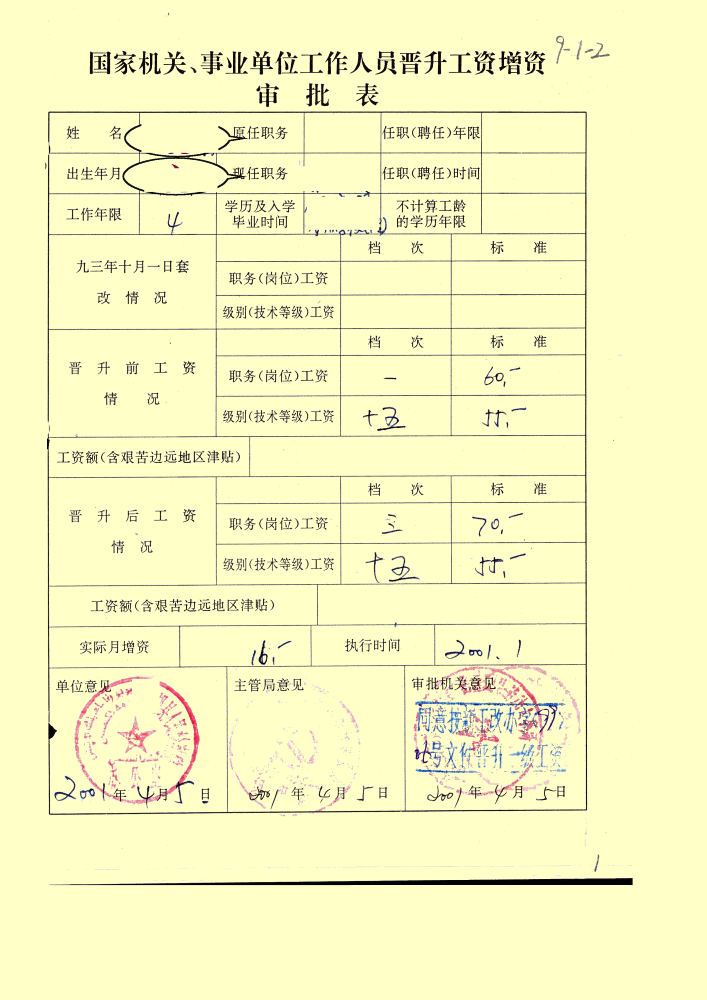

# change_background_color
改变扫描件背景颜色

## Building project
### Prerequisites
* C++11
* OpenCV3

## Exmaples

| **before**                             | **after**                               |
| :-:                                   | :-:                                   |     
|            |              |
|           |             |
